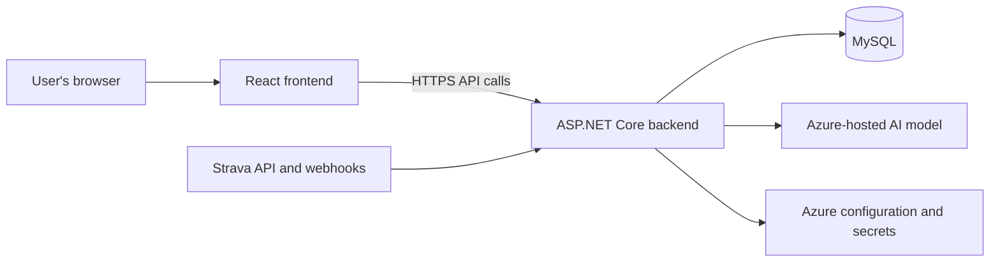

# Virtual Endurance Coach — Product Specification

## 1. Purpose

Build a personal AI coaching application focused on swimming, with running and strength training included where they affect the overall plan.

The application will import workouts from Strava, help the user define a goal, generate a training plan, and adapt that plan as new workouts and feedback are recorded.

This is a personal training project that will initially have up to three active users, but it should use a normal registered-user model rather than special-case a single local athlete. It does not need commercial product features, support for coaches or teams, complex roles, billing, or large-scale infrastructure.

## 2. Core experience

The application should answer four questions:

1. What am I training for?
2. What should I do next?
3. Why is that workout appropriate?
4. Should my plan change based on what I actually did and how I felt?

The typical loop is:

1. The user connects their Strava account.
2. The application imports recent workouts.
3. The user enters a swimming goal, availability, and relevant preferences.
4. The application generates a draft training plan.
5. The user reviews and activates the plan.
6. New activities are imported automatically when possible, with manual synchronization as a fallback.
7. The application matches each activity to a planned workout and optionally asks a few follow-up questions.
8. The application leaves the plan unchanged or suggests a focused adjustment.

## 3. Initial scope

### Required

- User registration, sign-in, sign-out, and basic account recovery.
- An athlete profile associated with the registered user.
- Connection to a Strava account.
- Import of historical and newly recorded Strava activities.
- Manual activity entry and correction.
- Swimming goal creation.
- One active training plan.
- A high-level plan view and detailed upcoming workouts.
- Matching imported activities to planned workouts.
- Optional post-workout feedback.
- Suggested plan adjustments based on completed workouts, missed workouts, and feedback.
- A simple explanation for each workout and suggested change.

### Later or optional

- Full running-specific training plans.
- Combined swimming and running goals.
- Delivery of structured workouts to a watch or external service.
- Notifications and reminders.
- Advanced performance prediction.
- Public availability.

## 4. Account and athlete profile

The application should support a conventional account flow:

- register with the required credentials;
- sign in and sign out;
- recover access to an account;
- keep each user's profile, goals, plans, activities, and Strava connection separate;
- update basic account information.

Up to three people are expected to use the project initially, so advanced account features such as social login, multiple roles, account administration, and organization membership are out of scope.

The profile should contain the information needed to create a reasonable plan:

- preferred units and time zone;
- swimming and running experience;
- recent training frequency and approximate volume;
- recent benchmark or race performances;
- available pool lengths;
- usual training days and time available per session;
- access to open water, swim equipment, and strength equipment;
- preferred or avoided strokes;
- desired amount of swimming, running, strength work, and rest;
- known limitations or injuries that should affect training.

## 5. Goals

The user should be able to create, edit, complete, and archive a goal. Only one goal needs to be active initially.

Supported swimming goals should include:

- completing an open-water distance;
- completing an open-water event under a target time or cutoff;
- preparing for one or more events at a pool meet;
- achieving a target time for a pool event;
- swimming a target distance continuously;
- improving a benchmark pace;
- building general swim fitness without a fixed event.

A goal may include:

- goal type and title;
- target date;
- event distance, stroke, and pool course where relevant;
- current or recent benchmark;
- target time, completion target, or cutoff;
- expected open-water conditions;
- personal notes and priority.

Before generating a plan, the application should identify missing information that materially affects the result. If a goal appears unusually aggressive for the time available, it should say so and explain why.

## 6. Strava activity import

The application should:

- connect and disconnect the user's Strava account;
- import an appropriate amount of recent activity history;
- receive new or changed activities through Strava webhooks where available;
- offer a manual refresh when automatic delivery is delayed or unavailable;
- avoid creating duplicates when an activity or webhook event is received more than once;
- handle expired authorization and allow reconnection;
- tolerate incomplete or inconsistent activity data.

Each imported activity should retain its Strava activity identifier. Relevant fields may include:

- sport and workout type;
- date and start time;
- duration and distance;
- pool length, laps, splits, intervals, and rests where available;
- pace, heart rate, cadence, stroke rate, water temperature, and other available measurements;
- elevation and route summaries for running;
- the planned workout to which the activity is matched;
- user corrections and feedback.

Imported data is imperfect. Missing values should be treated as unknown rather than zero, and inferred values should be distinguishable from Strava values or user-entered values.

## 7. Training plan generation

The plan should be based on:

- the goal and time remaining;
- recent training history and consistency;
- relevant benchmarks;
- available training days and time per session;
- pool, open-water, and equipment access;
- running, strength work, and other activities that contribute to fatigue;
- reported limitations, illness, soreness, or schedule disruptions;
- the completeness and reliability of the available data.

The generated plan should contain:

- start and end dates;
- major assumptions;
- training phases and the purpose of each phase;
- a weekly focus and approximate volume;
- recovery periods;
- benchmark sessions;
- taper and event preparation where relevant;
- individual workouts.

The plan should begin conservatively when historical data is sparse. Training load should increase progressively and should not jump solely because an ambitious target was entered.

## 8. Workout format

Each workout should include:

- date or suggested scheduling window;
- sport and workout type;
- purpose;
- estimated duration and distance;
- target effort or pace;
- equipment, if any;
- a structured warm-up, main set, and cool-down where appropriate;
- technique cues or important notes.

Swimming workouts must support repeated and nested sets. Each set should be able to describe:

- repetitions;
- distance or duration;
- stroke or drill;
- target pace or effort;
- rest;
- equipment.

The sum of the workout components should agree with the displayed total distance. The format should also support time-based and open-water workouts that do not divide neatly into pool lengths.

## 9. Plan and workout views

### Home

The home view should show:

- the next workout or recovery day;
- its purpose;
- the active goal and time remaining;
- any newly imported activity requiring review;
- any feedback question or proposed plan change.

### Plan overview

The plan overview should show:

- the complete plan by week;
- the current training phase;
- weekly focus and approximate volume;
- key workouts, benchmarks, recovery weeks, and the goal event;
- completed, missed, changed, and upcoming workouts.

### Workout detail

The workout view should show the full prescription, purpose, completion status, matched activity, and any relevant feedback or adjustment.

## 10. Activity matching

When an activity is imported, the application should try to match it to a planned workout using its date, sport, duration, distance, and structure.

A result may be:

- matched with high confidence;
- a possible match needing confirmation;
- an unplanned activity;
- a duplicate.

The user must be able to correct or remove a match. Re-importing an unchanged activity must not repeat its effect on the plan.

## 11. Post-workout feedback

After a workout, the application may ask a small number of optional questions. It should ask only for information that could clarify the activity or affect future training.

General questions may include:

- How hard did the workout feel?
- Did you complete the intended workout?
- How was your energy?
- Did you experience pain or unusual discomfort?
- Is anything important missing from the recorded data?

Swimming questions may cover:

- incorrect pool length, distance, intervals, or rests;
- how technique felt;
- open-water temperature, conditions, navigation, or equipment.

Strength questions may cover:

- exercises performed;
- sets and repetitions;
- weight or resistance;
- difficulty, technique, and soreness.

The user should be able to skip questions. Routine check-ins should be short, and the application should avoid repeatedly requesting information that the user rarely provides.

## 12. Adaptive planning

The application should reconsider the plan after a new activity, missed workout, relevant feedback response, or change to the user's goal or availability.

Useful signals include:

- whether the planned workout was completed;
- actual duration, distance, pace, and intensity;
- recent training volume and consistency;
- perceived effort, energy, pain, and soreness;
- hard unplanned activities or cross-training;
- proximity to the goal event.

The result may be:

- no change;
- a coaching observation;
- a change to one upcoming workout;
- a rescheduled key workout;
- reduced or increased volume or intensity;
- extra recovery;
- recalibrated training paces;
- a revision of the remaining plan.

A proposed change should explain:

- what would change;
- why;
- which information triggered it;
- which upcoming workouts are affected.

Material changes should require confirmation before being applied. The system should prefer the smallest useful change and should not overhaul the plan in response to one ordinary bad workout. It must not stack every missed workout onto later days.

## 13. Coaching rules

### General

- Base training on demonstrated capacity and availability, not only the desired result.
- Treat missing or questionable data as uncertainty.
- Increase workload gradually and include recovery.
- Consider unplanned workouts and other sports when estimating fatigue.
- Avoid clustering demanding sessions after rescheduling.
- Near an event, prioritize readiness over last-minute fitness gains.

### Swimming

- Use the correct pool length when calculating distance and pace.
- Do not assume automatically detected strokes, laps, intervals, or rests are correct.
- Account for differences among strokes, pool course, workout type, and rest interval.
- Keep all prescribed set arithmetic internally consistent.
- For open-water goals, include relevant sustained swimming, sighting, navigation, environmental preparation, and equipment practice where safely available.
- Never recommend swimming alone in unsafe open water.

### Running and strength

- Include running and strength work in overall fatigue even before full plans for those sports exist.
- Do not translate pace or distance directly between sports.
- Avoid scheduling hard sessions from different sports too close together without a reason.
- Do not trust activity data to identify strength exercises or weights reliably; ask for corrections when that information matters.

### Safety

The application is a planning tool, not a medical service. It should not diagnose injuries or illnesses. Reports of pain, illness, or extreme fatigue should lead to conservative training advice. Potentially urgent symptoms should result in a clear recommendation to stop training and seek appropriate help rather than ordinary workout optimization.

## 14. Manual corrections

The user should be able to:

- add an activity manually;
- mark a workout complete without imported data;
- correct distance, pool length, intervals, exercises, sets, repetitions, or weight;
- mark an activity as unrelated to the plan;
- resolve duplicates;
- give a reason for a missed or changed workout.

The original Strava values should remain available alongside corrections when useful for troubleshooting.

## 15. Simple conceptual data model

- **User account:** credentials and basic account information.
- **Athlete:** user reference, profile, preferences, availability, benchmarks, and limitations.
- **Strava connection:** authorization, athlete identifier, synchronization checkpoint, and latest status.
- **Activity:** imported or manual workout data, corrections, feedback, and planned-workout match.
- **Goal:** type, event details, baseline, target, date, and status.
- **Training plan:** assumptions, phases, weeks, workouts, and current version.
- **Planned workout:** schedule, purpose, structured prescription, completion state, and matched activity.
- **Check-in:** optional post-workout questions and answers.
- **Plan change:** trigger, explanation, affected workouts, proposed edits, and acceptance state.

## 16. Conceptual technical architecture

### 16.1 Overall approach

Use a modular monolith rather than separate microservices. The application should have one React frontend, one .NET backend, and one MySQL database. Features should be separated into modules inside the backend so that responsibilities remain clear without adding deployment complexity.

### 16.2 Frontend

- **Framework:** React with TypeScript.
- **Application style:** a single-page application that calls the backend through a JSON API.
- **Hosting:** Azure Static Web Apps.
- **Responsibilities:** account screens, goal and profile forms, plan views, workout details, activity review, check-ins, and plan-change confirmation.
- **State:** keep server-owned data in the backend; use frontend state only for interface state, cached responses, and unfinished form input.

The frontend should not call Strava or the AI model directly and should never contain service secrets.

### 16.3 Backend

- **Framework:** ASP.NET Core Web API on .NET.
- **Hosting:** Azure App Service.
- **Architecture:** a modular monolith with separate modules for accounts, athlete profiles, Strava synchronization, activities, goals, plans, check-ins, and coaching.
- **API style:** resource-oriented HTTP endpoints with typed request and response models.
- **Data access:** Entity Framework Core with a MySQL-compatible provider and schema migrations.
- **Validation:** validate requests and all AI-generated structured output before saving it.

Business rules should live in backend application or domain services rather than controllers or React components. This includes workout-total calculations, activity matching, plan state changes, and decisions about whether a proposed adjustment requires confirmation.

### 16.4 Authentication

- Use the standard .NET identity system for registration, password hashing, sign-in, sign-out, and account recovery.
- Prefer secure, HTTP-only authentication cookies so browser code does not store long-lived credentials.
- Every user-owned record must include or resolve to a user identifier, and backend queries must enforce that boundary even though only a few users are expected.
- Strava authorization tokens belong to a specific user and must be stored securely.

### 16.5 Data storage

- **Local development:** a local MySQL instance, preferably started through a repeatable development setup.
- **Azure:** Azure Database for MySQL Flexible Server using a small, development-appropriate tier.
- **Data shape:** use relational tables for accounts, profiles, activities, goals, plans, workouts, check-ins, and plan changes.
- **Flexible fields:** use JSON columns sparingly for source payload fragments or structured workout details that would otherwise require an impractical number of tables.
- **Migrations:** keep schema changes in source control and apply them through a repeatable migration process.

The normalized activity and plan data should remain independent of Strava's response format. Raw response fragments may be retained for debugging, but application features should use normalized records.

### 16.6 Strava integration and background work

The backend owns the Strava authorization flow, API calls, token refresh, and webhook endpoint.

The webhook endpoint should validate the request, record enough information to deduplicate the event, and return promptly. Importing full activity details, matching the activity, and evaluating the plan can then run as background work.

For the initial project, background processing can use a hosted .NET background service in the same application. A scheduled reconciliation job should periodically check for missed activities. If in-process work becomes unreliable, move queued work to an Azure-managed queue and a separate worker without changing the core domain modules.

### 16.7 AI coaching integration

Use an Azure-hosted AI model behind a backend interface so the exact model can be changed without rewriting plan or activity code.

The AI component may:

- generate a draft plan from a defined input structure;
- propose post-workout questions;
- interpret subjective feedback;
- propose an explained plan adjustment.

The AI component must return a defined structured response rather than directly update the database. The backend should validate:

- required fields and allowed values;
- workout set arithmetic;
- dates and scheduling constraints;
- references to existing activities and workouts;
- whether the change requires user confirmation;
- basic safety rules.

Store the model request context, response, and prompt version needed to explain or reproduce a coaching decision, while avoiding unnecessary duplicate personal data.

### 16.8 Azure services

The initial Azure deployment should use:

- **Azure Static Web Apps** for the React frontend;
- **Azure App Service** for the ASP.NET Core API and initial background worker;
- **Azure Database for MySQL Flexible Server** for relational data;
- **an Azure-hosted AI model service** for coaching generation;
- **Azure Key Vault or protected App Service configuration** for database credentials, Strava secrets and tokens, and AI credentials;
- **Azure Monitor/Application Insights** for backend errors, request traces, and synchronization diagnostics.

Keep all resources in one Azure region where possible. Advanced networking, high availability, autoscaling, multiple environments, and distributed messaging are unnecessary for the first version.

### 16.9 Development and deployment

- Keep the frontend and backend in one repository unless a practical reason to split them appears.
- Provide one command or documented sequence to start the frontend, backend, and local database.
- Keep configuration outside source code and provide safe local-development placeholders.
- Run backend tests, frontend tests, and production builds in continuous integration.
- Deploy the frontend and backend automatically from the main branch after checks pass.
- Add infrastructure-as-code only after the initial Azure resources and required configuration are understood.

### 16.10 Testing priorities

- Unit-test workout arithmetic, training rules, activity matching, and plan-change logic.
- Integration-test registration, database operations, and Strava synchronization against controlled substitutes.
- Verify that duplicate webhook delivery does not create duplicate activities or plan changes.
- Contract-test AI responses against the required structured schema.
- Include a small end-to-end path from registration through plan creation and activity review.

## 17. First end-to-end milestone

The first complete version is successful when it can:

1. Register, sign in, sign out, and recover access to an account.
2. Save the user's profile, schedule, and pool information under that account.
3. Connect to Strava and import swimming activities without duplicates.
4. Create a dated swimming goal with a baseline and target.
5. Generate a plan that respects availability and contains valid workout totals.
6. Display the complete plan and detailed upcoming workouts.
7. Import a new activity and match it to the appropriate planned workout.
8. Collect perceived effort and missing workout details.
9. Either leave the plan unchanged or suggest a specific, explained adjustment.
10. Apply an accepted adjustment without repeating it when the same activity is processed again.
11. Handle a missed workout without blindly moving it to the next day.

## 18. Important edge cases

- There is little or no useful training history.
- The same Strava activity or webhook event is received more than once.
- A pool activity contains the wrong pool length or lap count.
- One recording covers only part of a workout.
- An unplanned hard workout affects the next key session.
- Several workouts are missed because of illness or travel.
- The goal or weekly availability changes mid-plan.
- Subjective feedback conflicts with recorded performance.
- The goal date is too close for the requested improvement.

## 19. Open decisions

- How much Strava history should be imported for the first plan?
- Which goal types should be implemented first?
- How long may an initial plan be?
- How should training load and pace zones be estimated?
- Should low-risk plan changes ever apply automatically?
- How often should post-workout questions appear?
- Should structured workouts eventually be sent to another service or device?
- Which Azure-hosted AI service and model should be used?
- Should initial background jobs remain inside the API or use a queue from the start?
- Should the React frontend and API share a parent domain to simplify cookie authentication?

## 20. Suggested build order

1. Registration, authentication, athlete profile, goal entry, and manual activity entry.
2. Basic plan generation and plan/workout views.
3. Strava connection and activity synchronization.
4. Activity matching and completion tracking.
5. Post-workout questions.
6. Plan-change suggestions and confirmation.
7. Running support and other optional features.
